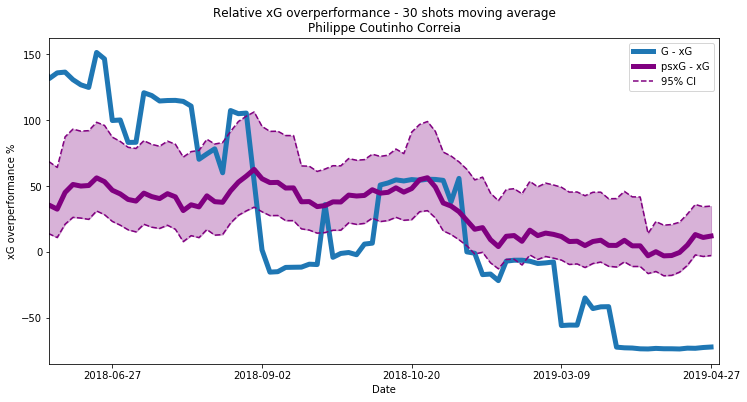

# finishing_ability
A modelling framework to produce a finishing ability metric from StatsBomb event data

Please see [Finishing Ability: Uncovering The Signal](https://www.opengoalapp.com/finishing-ability) for implementation details.

The main code can be found in finishing_ability.py which makes use of 2 custom helper functions: GetMatchDates.py and PrepareIO.py

Please note you will need xgboost, shapely, sklearn, statsbombpy, itertools and scipy installed in your environment.

  

  

All data stored within this repo has been provided by StatsBomb under their open data initiative and usage is subject to their terms and conditions.

  

 
